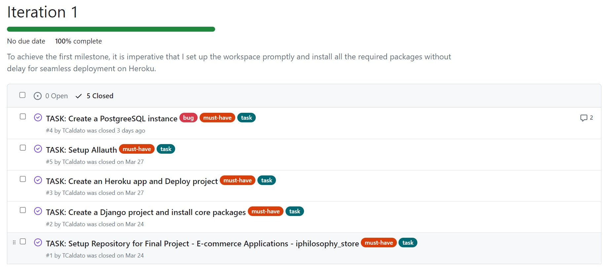
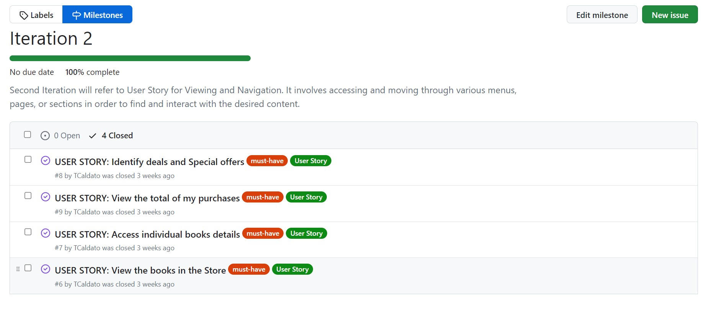
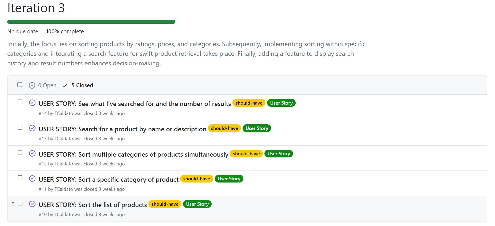
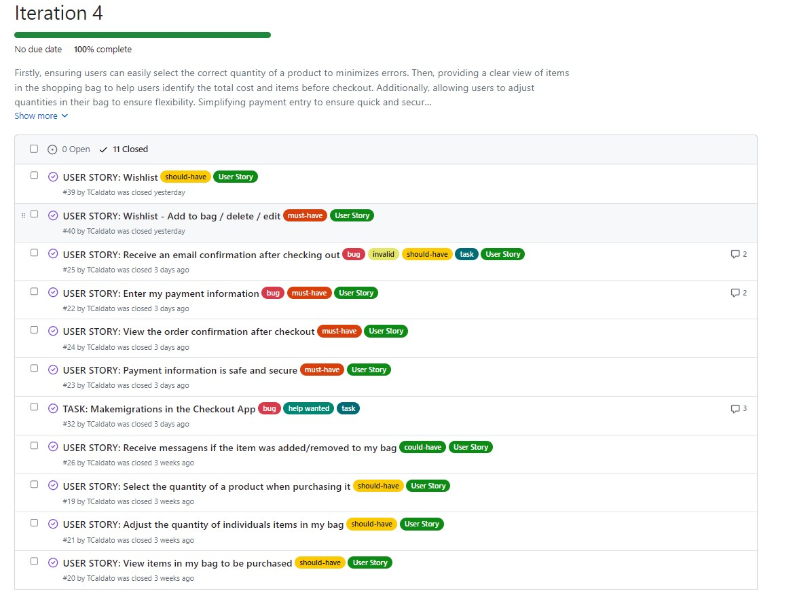
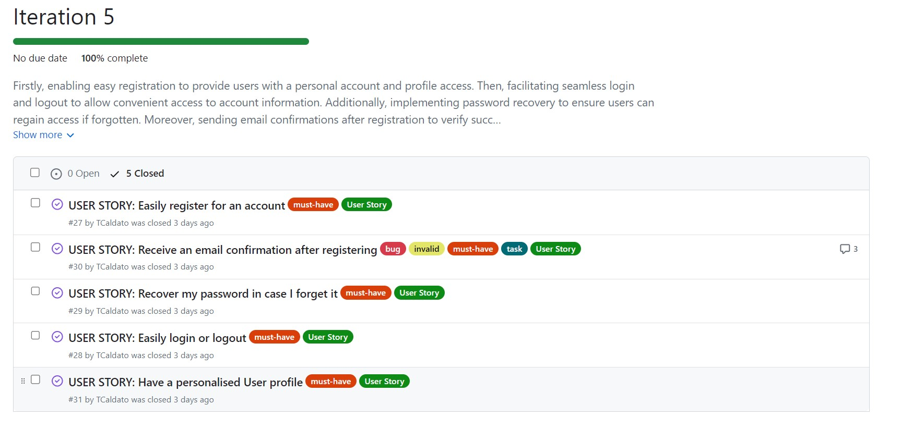
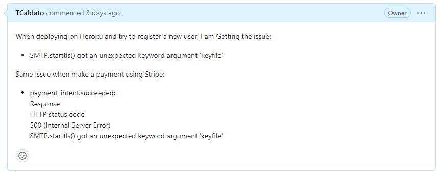
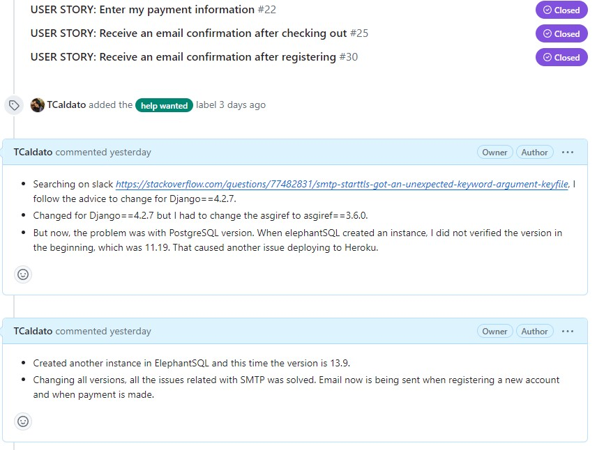
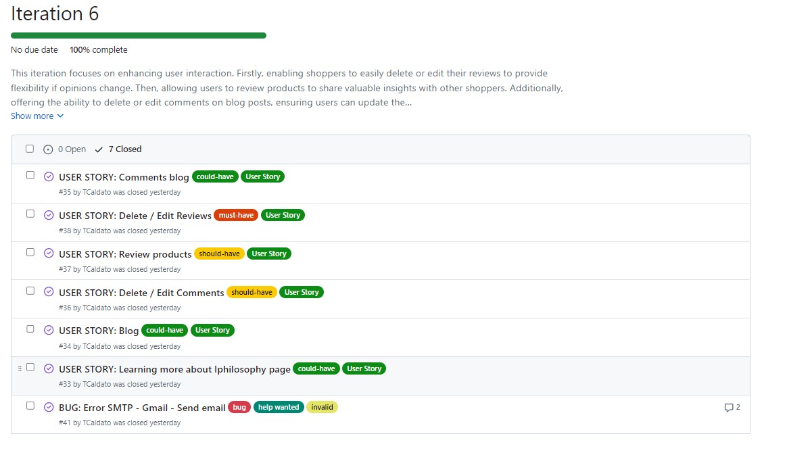
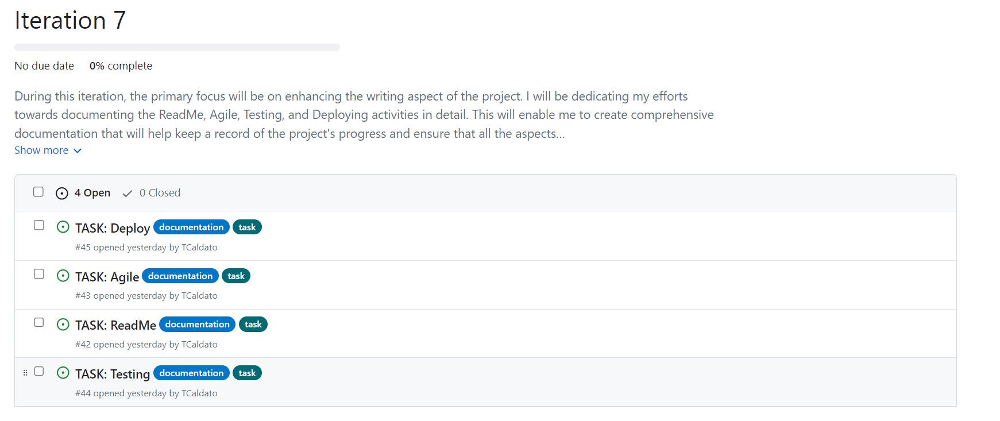

# Agile

As a practitioner of agile methodology, my approach to project management involves dividing the overall project into smaller, more manageable parts. These parts, also known as iterations, represent distinct phases in the project development process that must be completed in order to achieve the desired outcome. In my case, I divided the project into seven iterations, with each iteration representing a specific set of tasks or user's story that must be accomplished. By breaking down the project into smaller parts, I am able to more effectively manage the development process and ensure that each phase is completed to a high standard before moving on to the next one.

## Table of contents

1. [Agile First Iteration](#agile-first-iteration)
2. [Agile Second Iteration](#agile-second-iteration)
3. [Agile Third Iteration](#agile-third-iteration)
4. [Agile Fourth Iteration](#agile-fourth-iteration)
5. [Agile Fifth Iteration](#agile-fifth-iteration)
6. [Agile Sixth Iteration](#agile-sixth-iteration)
7. [Agile Seventh Iteration](#agile-seventh-iteration)

Back to Readme file [ReadMe](README.md)

Listed below are the seven iterations, each with their own objectives.

## Agile First Iteration

At the beginning of any project, it's essential to ensure that everything is set up correctly for deployment, and that's precisely what I focused on initially. I followed the Code Institute's steps as they provided a clear roadmap for starting a project, and the first step was to ensure that it was set up correctly for deployment on Heroku.
By doing so, I was able to avoid any potential future issues, such as bugs or other complications. Adhering to the Agile approach, I then moved on to the first phase of the project, which involved creating a comprehensive list of tasks that I needed to complete. This helped me to break down the project into smaller, more manageable chunks, allowing me to work more efficiently.

### The first phase included the Tasks:

- Task: Setup Repository for Final Project - E-commerce Applications - iphilosophy_store **[#1](https://github.com/TCaldato/iphilosophy_store/issues/1)**
- Task: Create a Django project and install core packages **[#2](https://github.com/TCaldato/iphilosophy_store/issues/2)**
- Task: Create an Heroku app and Deploy project **[#3](https://github.com/TCaldato/iphilosophy_store/issues/3)**
- Task: Create a PostgreeSQL instance **[#4](https://github.com/TCaldato/iphilosophy_store/issues/4)**
- Task: Setup Allauth **[#5](https://github.com/TCaldato/iphilosophy_store/issues/5)**

During the last task of the first phase, the project was configured to utilise a relational database. As a result, when the project was deployed, all the necessary connections were already established.

[Back to top](#agile)

## Agile Second Iteration

The user story for the second iteration involves the process of accessing and moving through various menus, pages, or sections with the aim of finding and interacting with the desired content. The user will be able to browse through a wide range of books available in the store, access detailed information about individual books, identify ongoing deals and special offers, and view the total amount of purchases made. This user story aims to provide a seamless and user-friendly experience to the user while navigating through the application.

### The second phase included the User Stories:

- User Story: View the books in the Store **[#6](https://github.com/TCaldato/iphilosophy_store/issues/6)**
- User Story: Access individual books details **[#7](https://github.com/TCaldato/iphilosophy_store/issues/7)**
- User Story: Identify deals and Special offers **[#8](https://github.com/TCaldato/iphilosophy_store/issues/8)**
- User Story: View the total of my purchases **[#9](https://github.com/TCaldato/iphilosophy_store/issues/9)**

[Back to top](#agile)

## Agile Third Iteration

The user story for the second iteration focuses on enhancing the product sorting and searching capabilities within the application. Initially, users will have the ability to sort products based on different criteria such as ratings, prices, and categories. Following this, more refined sorting capabilities will be introduced, allowing users to sort products within specific categories. The integration of a robust search feature will enable swift retrieval of products by name or description.

### The third phase included the User Stories:

- User Story: Sort the list of products **[#10](https://github.com/TCaldato/iphilosophy_store/issues/10)**
- User Story: Sort a specific category of product **[#11](https://github.com/TCaldato/iphilosophy_store/issues/11)**
- User Story: Sort multiple categories of products simultaneously **[#12](https://github.com/TCaldato/iphilosophy_store/issues/12)**
- User Story: Search for a product by name or description **[#13](https://github.com/TCaldato/iphilosophy_store/issues/13)**
- User Story: See what I’ve searched for and the number of results **[#14](https://github.com/TCaldato/iphilosophy_store/issues/14)**

[Back to top](#agile)

## Agile Fourth Iteration

During the fourth iteration, my focus was on streamlining the checkout process. I added several features that would allow users to easily purchase products from the website. I added the ability for users to select the quantity of a product they wanted to purchase. This feature would make it easier for users to buy multiple items at once. I also made sure that users could view the items in their shopping cart and adjust the quantity of each item as needed.

### The fourth phase included the User Stories:

- User Story: Select the quantity of a product when purchasing its **[#19](https://github.com/TCaldato/iphilosophy_store/issues/19)**
- User Story: View items in my bag to be purchased **[#20](https://github.com/TCaldato/iphilosophy_store/issues/20)**
- User Story: Adjust the quantity of individuals items in my bag **[#21](https://github.com/TCaldato/iphilosophy_store/issues/21)**
- User Story: Enter my payment information **[#22](https://github.com/TCaldato/iphilosophy_store/issues/22)**
    - During the development process, I encountered a bug related to SMTP, *issue: SMTP.starttls() got an unexpected keyword argument 'keyfile'*. This bug made it difficult for the website to send out email confirmations to users after they had completed a purchase. I spent time troubleshooting and resolved the issue.More descriptive information about the bug is in [Issues and Bugs](README.md) in the ReadMe file.

After completing the checkout process, users were able to view an order confirmation on the website. They would also receive an email confirmation of their purchase. Additionally, I added a feature that would allow users to receive messages when items were added or removed from their shopping cart. This would help users keep track of their shopping cart and ensure that it contained the products they wanted to purchase. Also payment information users entered during the checkout process remained secure.

- User Story: Payment information is safe and secure **[#23](https://github.com/TCaldato/iphilosophy_store/issues/23)**
- User Story: View the order confirmation after checkout **[#24](https://github.com/TCaldato/iphilosophy_store/issues/24)**
- User Story: Receive an email confirmation after checking out **[#25](https://github.com/TCaldato/iphilosophy_store/issues/25)**
    - For this User Story, I went through a bug related with SMTP, issue: SMTP.starttls() got an unexpected keyword argument 'keyfile' as well, Stripe was not sending e-mails when receiving payments. More descriptive information is in [Issues and Bugs](README.md) in the ReadMe file.
- User Story: Receive messagens if the item was added/removed to my bag **[#26](https://github.com/TCaldato/iphilosophy_store/issues/26)**
- Task: Makemigrations in the Checkout App **[#32](https://github.com/TCaldato/iphilosophy_store/issues/32)**
    - A Task was created to document a issue with migrations in the Checkout App. error message: django.db.utils.DataError: value too long for type character varying(2). I documented them in the [Issues and Bugs](README.md) section of the ReadMe file.

Finally, I added a wishlist feature that would allow users to add, delete, and edit items in their wishlist. This feature would make it easier for users to keep track of the products they wanted to purchase in the future.

- User Story: Wishlist **[#39](https://github.com/TCaldato/iphilosophy_store/issues/39)**
- User Story: Wishlist - Add to bag / delete / edit **[#40](https://github.com/TCaldato/iphilosophy_store/issues/40)**

[Back to top](#agile)

## Agile Fifth Iteration

For the fifth iteration, I focused on creating an intuitive registration process that would allow users to easily create an account and start shopping. Additionally, I implemented a login and logout system that ensured user data was kept secure at all times. I also developed a password recovery system that would allow users to easily reset their password if they forgot it. To ensure that users could trust the website, I added an email confirmation feature that would send an email to users after they registered, letting them know that their account was successfully created.

### The fifth phase included the User Stories:

- User Story: Easily register for an account **[#27](https://github.com/TCaldato/iphilosophy_store/issues/27)**
- User Story: Easily login or logout **[#28](https://github.com/TCaldato/iphilosophy_store/issues/28)**
- User Story: Recover my password in case I forget it **[#29](https://github.com/TCaldato/iphilosophy_store/issues/29)**
- User Story: Receive an email confirmation after registering **[#30](https://github.com/TCaldato/iphilosophy_store/issues/30)**
    - However, during the deployment process on Heroku, I encountered an issue related to the SMTP.starttls() function. Specifically, the error was related to an unexpected keyword argument 'keyfile'.

As a result, I was unable to register new users. To address these issues, I documented them in the [Issues and Bugs](README.md) section of the ReadMe file. Finally, I created a personalized user profile that would allow users to customize their experience on the website.

- User Story: Have a personalised User profile **[#31](https://github.com/TCaldato/iphilosophy_store/issues/31)**

[Back to top](#agile)

## Agile Sixth Iteration

This sixth iteration focuses on enhancing user interaction by introducing new functionalities to various components. The primary interaction was to the blog section, where I implemented a commenting system that allows users to add, edit, and delete their comments. Moreover, I developed a review feature that allows customers to share their experience with the products and edit or delete their reviews as per their convenience. 

### The sixth phase included the User Stories:

- User Story: Learning more about Iphilosophy page **[#33](https://github.com/TCaldato/iphilosophy_store/issues/33)**
- User Story: Blog **[#34](https://github.com/TCaldato/iphilosophy_store/issues/34)**
- User Story: Comments blog **[#35](https://github.com/TCaldato/iphilosophy_store/issues/35)**
- User Story: Delete / Edit Comments **[#36](https://github.com/TCaldato/iphilosophy_store/issues/36)**
- User Story: Review products **[#37](https://github.com/TCaldato/iphilosophy_store/issues/37)**
- User Story: Delete / Edit Reviews  **[#38](https://github.com/TCaldato/iphilosophy_store/issues/38)**

During the development process, I encountered many times, an issue with the SMTP protocol while trying to send emails through Gmail. To address this issue, I created a detailed bug report that explained the problem and the steps taken to fix it. I documented them in the [Issues and Bugs](README.md) section of the ReadMe file.

- BUG: Error SMTP - Gmail - Send emails **[#41](https://github.com/TCaldato/iphilosophy_store/issues/41)**

[Back to top](#agile)

## Agile Seventh Iteration

During the seventh iteration, the primary focus will be on enhancing the writing aspect of the project. I will be dedicating my efforts towards documenting the ReadMe, Agile, Testing, and Deploying activities in detail. This will enable me to create comprehensive documentation that will help keep a record of the project's progress and ensure that all the aspects of the project are well-documented.

### The seventh phase included the Tasks:

- Task: ReadMe **[#42](https://github.com/TCaldato/iphilosophy_store/issues/42)**
- Task: Agile **[#43](https://github.com/TCaldato/iphilosophy_store/issues/43)**
- Task: Testing **[#44](https://github.com/TCaldato/iphilosophy_store/issues/44)**
- Task: Deploy **[#45](https://github.com/TCaldato/iphilosophy_store/issues/45)**

[Back to top](#agile)

Back to Readme file [ReadMe](README.md)
