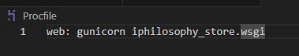

# Deployment

## Table of contents

1. [Introduction](#introduction)
2. [Deploying on Heroku](#deploying-on-heroku)
3. [Install Django with required packages](#install-django-with-required-packages)
4. [Create a new Django project](#create-a-new-django-project)
5. [Deploy project to Heroku](#deploy-project-to-heroku)
6. [Set up project to use a relational database](#set-up-project-to-use-a-relational-database)
7. [Connect Heroku to the PostgreSQL database](#connect-heroku-to-the-postgresql-database)

## Introduction

To ensure a smooth submission process, I made an initial effort to deploy this project on Heroku as early as possible.
This allowed me to work through any potential issues and make necessary adjustments with ample time before the submission deadline.

Below are the detailed steps that were carefully followed the **Code Institute** guides to ensure that everything worked seamlessly and without any issues.

## Deploying on Heroku

In order to deploy a basic application on Heroku using Github, the following steps were taken:

1. Install Django with required packages
2. Create a new Django project
3. Deploy project to Heroku
4. Set up project to use a relational database (PostgreSQL)
5. Connect Heroku to the PostgreSQL database

## Install Django with required packages

*Django*, a full stack framework will support this project.

To install, type *pip3 install 'Django'* into the terminal.

Install gunicorn (web server) by typing *pip3 install gunicorn*.

Install the dj_database_url library for postgreSQL by typing *pip3 install dj_database_url*, then install the psycopg2 library for postgreSQL by typing *pip3 install psycopg2-binary*.

Create a requirements.txt file in the main directory.

In the terminal, type *pip3 freeze --local > requirements.txt*.  This file tells Heroku what packages are needed to run the deployed application.  Follow this step each time a new package is installed.

[Back to top](#deployment)

## Create a new Django project

I created a new *project* called *iphilosophy_store* typing the following to the terminal, `django-admin startproject iphilosophy_store`
This will create new folder called `iphilosophy_store` and a `manage.py` file in the root directory.

Next step, I created an app called `home` within the project. Type *python3 manage.py startapp home*. This app will act as the homepage.

After I opend the `settings.py` file in the `iphilosophy_store` **project** folder and add the newly created *home* app to the bottom of the Installed Apps list. (Add a comma to the end even though it's the last list entry.)

 - In views.py, import HttpResponse from django.http at the top of the file, *from django.http import HttpResponse*
 - Add the following view function to return a HttpResponse of "Hello, World!" *def iphilosophy_store(request): return HttpResponse("Hello, World!")*
 - In *iphilosophy_store/urls.py* import the *my_home view*: *from home.views import my_home*.
 - Add the new path to the urlpatterns: *path('home/', my_home, name='home')*,

In the terminal, type *python3 manage.py migrate* to update the database schema used by Django.

In the terminal, type *python3 manage.py runserver* to verify local deployment. Append */home* to the end of the URL in the browser. An error message open in the browser. Copie the hostname between the square brackets in the error message to ALLOWED_HOSTS in the *iphilosophy_store/settings.py* file, and add *,'.herokuapp.com'* and saved it.

Confirm the text *Hello, World!* is displayed on the page.

[Back to top](#deployment)

## Deploy project to Heroku

Create the Heroku app:

1. Navigate to your Heroku dashboard and create a new app with a unique name in a region close to you.
2. In your new app's settings tab, ensure the Config Var DISABLE_COLLECTSTATIC key has a value of 1.
3. A Procfile is needed in the main directory to tell Heroku the commands that are to be executed by the app on startup. In this case we need to start a web server (gunicorn).

4. Click on the Deploy tab in your Heroku app dashboard, connect to your GitHub repo and click on Deploy Branch.
5. Click the Open app button to see your deployed app.

[Back to top](#deployment)

## Set up project to use a relational database

For this project, an account was created for **ElephantSQL** that is a PostgreSQL database hosting service that uses several cloud-hosted platforms. 

The steps to create a PostgreSQL instance were followed according to the Code Institute course and can be done by following the steps below:

### Create PostgreSQL instance

Log into ElephantSQL to access your dashboard:

1. Click Create New Instance:

2. Set up your plan:

 - Give your plan a Name (this is commonly the name of the project).
 - Select the Tiny Turtle (Free) plan.
 - You can leave the Tags field blank.
 - Then click Select Region.

3. Select a data centre near you
4. Click Review.
5. Check your details are correct and then click Create instance.
6. Click on your newly named instance.

7. If your PostgreSQL version is 12 or higher then click on DETAILS and copy the URL.

[Back to top](#deployment)

### Connect database to code

8. Return to your workspace and open the *iphilosophy_store/settings.py* file. Change the value of *DEBUG* to *True*
9. Create a file named env.py at the top level of the project.
10. Open the .gitignore file and add env.py to prevent the secret data you will add to it from being pushed to GitHub.
11. In your newly created env.py file, import Python's operating system module and use it to set the value of the DATABASE_URL constant to the URL you copied from ElephantSQL.

12.  In iphilosophy_store/settings.py, import the appropriate packages.

13. Next in the settings.py file, you need to comment out the local sqlite3 database connection and then connect to the environment variable DATABASE_URL you previously added to the env.py file.

14. Now that the project is connected to the database, you can create database tables with Django's migrate command *python3 manage.py migrate*.

15. Deploy the project. Return to your workspace and open the iphilosophy_store/settings.py file. Change the value of DEBUG back to False as this will ensure the production deployed app is secure. Git add, commit and push your updated code to GitHub. Return to your Heroku dashboard and go to your it_restaurant app. Click on the Deploy tab. Do a manual deployment.

[Back to top](#deployment)

## Connect Heroku to the PostgreSQL database

1. Once the deployment is complete click on Reveal Config Vars in the Settings tab on Heroku.
2. Add a new config var with a key of DATABASE_URL and the value of the ElephantSQL URL.

Now your deployed app is connected to your PostgreSQL cloud database.

**These steps are current to the time of deployment and may change in the future.**

[Back to top](#deployment)

Back to Readme file [README.md](README.md)
