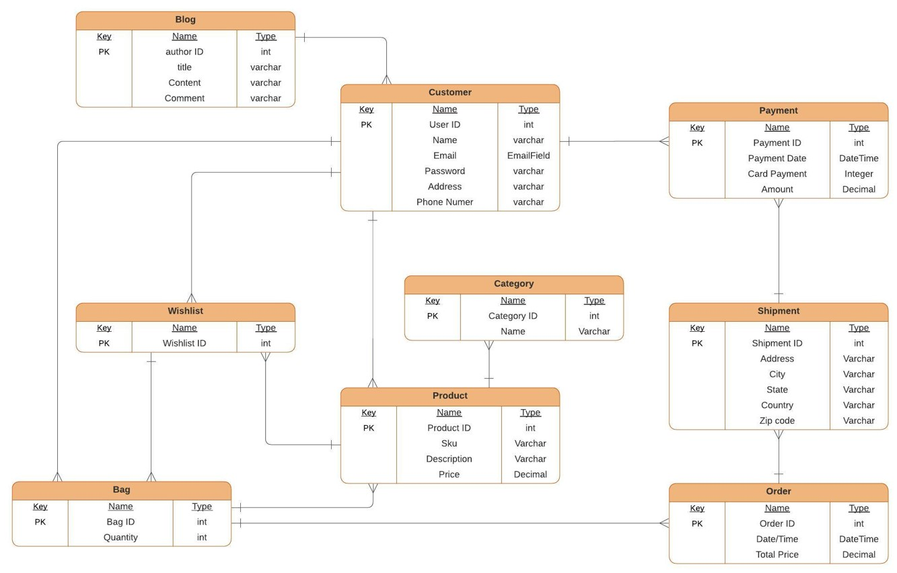
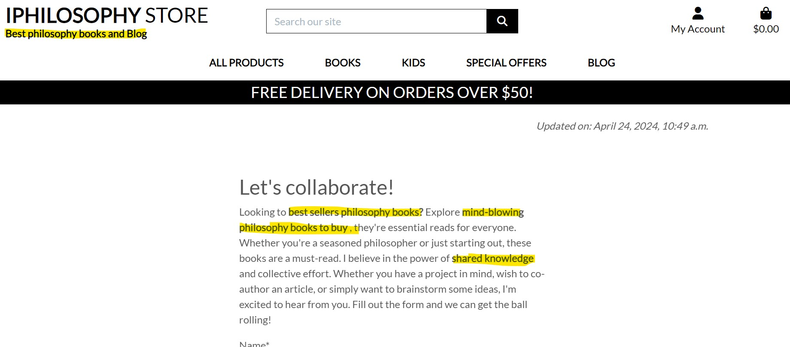
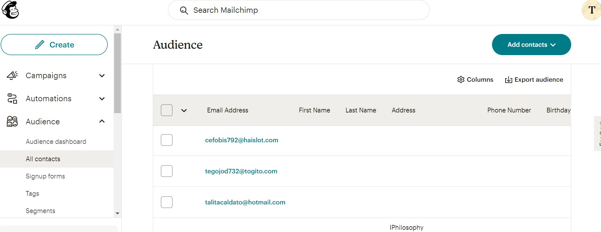

# Iphilosophy Store

Welcome to Iphilosophy, your premier online destination for exploring and purchasing philosophical literature. Built using the latest web technologies including HTML, CSS, JavaScript, and Python, powered by the Django framework and Bootstrap for a responsive and seamless experience. Transactions are secure and straightforward with Stripe for payments.

Iphilosophy is more than just an e-commerce site; it’s a community. Our platform features an engaging blog where philosophy enthusiasts can discuss ideas, comment on posts, and registered users can leave product reviews. We employ robust marketing strategies across SEO, social media, and email to extend our reach and connect with more users.

You can check the live website [here](https://iphilosophy-store-81d2532ac343.herokuapp.com/)

## Table of contents

1. [Introduction](#introduction)
    1. [About the Project IPhilosophy Store](#about-the-project-iphilosophy-store)
2. [UX](#ux)
    1. [User Stories](#user-stories)
    2. [Design Thinking](#design-thinking)
    3. [Intuitive Design](#intuitive-design)
    4. [Database Design](#database-design)
3. [Features](#features)
    1. [Future Features](#future-features)
4. [Technologies Used](#technologies-used)
    1. [Languages](#languages)
    2. [Frameworks, Libraries and Programs Used](#frameworks-libraries-and-programs-used)
5. [Testing](#testing)
6. [Issues and Bugs](#issues-and-bugs)
    1. [Remaining Bugs](#remaining-bugs)
7. [Deployment](#deployment)
8. [Credits](#credits)
9. [Acknowledgements](#acknowledgements)

# Introduction

## About the Project Iphilosophy Store

A Full-Stack E-commerce was developed for this project, which utilizes business logic to manage a centralized dataset. A role-based access authentication mechanism was implemented to ensure secure access to the website's data. The website was built using a combination of HTML, CSS, JavaScript, Python, and the Django and Bootstrap frameworks, payments are made using Stripe and Postgres serving as the relational database. An Agile approach was employed throughout the project. The project also involved the implementation of authorization, authentication, and permission features in a Full-Stack web application solution. Furthermore, the project utilized object-based software concepts to achieve its goals.

## UX

### User-Stories

In the Agile approach, a "user story" is a technique that assists in capturing the user's perspective and needs. It is a simple, yet powerful tool that shifts the focus from documenting requirements to discussing them. A user story is a brief, informal description from a user's point of view that explains what they want to achieve with the product. It encourages collaboration between the development team and the user, as it sparks meaningful conversations about the features and functionality that the user story represents. This approach promotes a better understanding of the user's needs, resulting in a product that meets their requirements and delivers value to the user.

The Agile User Story technique has been documented in a separate file. You can check by on [Agile file](AGILE.md)

### Design Thinking

In order to optimize user experience on the developed website, it is important to apply a Design Thinking approach to determine the most useful features. However, given the time constraints of a hard deadline, it is necessary to assess the feasibility of a student developer delivering prioritized features. It is worth mentioning that the project must incorporate CRUD functionality, as per the assessment criteria, which provides a broad outline of the fundamental requirements.

During a preliminary brainstorming session, a few ideas were suggested to enhance the website's user experience:

| Feature                                 | Importance | Feasibility |
|:----------------------------------------|:----------:|:-----------:|
| Easily register for an account          | 5          | 5           |
| Update account information              | 5          | 5           |
| Access easily the site products         | 5          | 5           |
| Have a philosophy Blog                  | 4          | 4           |
| Comment the Blog                        | 3          | 3           |
| Review Products                         | 5          | 5           |
| View a list of products                 | 5          | 5           |
| Select products to purchase             | 5          | 5           |
| View individual products details        | 5          | 5           |
| View the total of my purchases          | 5          | 5           |
| Have an User profile                    | 5          | 5           |
| Search for a product                    | 4          | 4           |
| View items in my bag                    | 5          | 5           |
| Have a wishlist                         | 4          | 4           |
| Enter payment information               | 5          | 5           |
| Receive an email after checking out     | 5          | 5           |
| Add a product to the website            | 5          | 5           |
| Edit/Update a product                   | 5          | 5           |
| Delete a product                        | 5          | 5           |
|:----------------------------------------|:----------:|:-----------:|
| Total                                   | 90         | 90          |

The analysis of the feasibility and importance scores indicates that the project is both practically achievable and highly valuable. Therefore, based on the data, the project is deliverable.

[Back to top](#iphilosophy-store)

### Intuitive Design

The main goal for creating the Iphilosophy e-commerce website was to make it user-friendly and easy to navigate. To accomplish this, the Boutique Ado e-commerce from Code Institute, was used as reference to develop Iphilosophy Store.

I started by selecting the straightforward layout that users could easily navigate. The navigation bar at the top of each page, making it consistently, clearly labeled each page and button with concise titles to ensure users always knew where they were.

Throughout the site, it was maintained a uniform font, color scheme, and layout style. This consistent design approach helped create a cohesive and intuitive experience, making it easier for users to understand and navigate the site without confusion.

Additionally, it was ensured the website was optimized for all devices, from desktops to smartphones. By employing responsive design techniques, the site's layout adjusts to fit the screen of any device being used. This optimization guarantees that all visitors, no matter what device they are on, experience the site seamlessly, enhancing overall user satisfaction.

### Database Design

When working with Django, it's important to have a clear understanding of the database architecture before creating models. This is where Entity Relationship Diagrams come in handy as they allow you to visualize the relationships between different tables. By doing so, it is possible save valuable time later on in the project by avoiding the need to recode.

[Back to top](#iphilosophy-store)

## SEO, Social Media and Email strategies

### SEO

Search Engine Optimization (SEO) is a pivotal strategy in digital marketing, especially for niche e-commerce sites like Iphilosophy, which focuses on philosophical literature. SEO involves various techniques to enhance a website's visibility and attract more relevant traffic from search engines. One critical component of effective SEO is the implementation of HTML metadata and the strategic use of keywords within website content.

For Iphilosophy, we use HTML metadata to communicate the essence and offerings of our site to search engines. The <meta name="description"> tag, for instance, is carefully crafted with a rich description incorporating targeted keywords such as "Greatest Philosophy Books" and "Best Philosophy Books." These keywords are selected based on their alignment with potential search queries that our target audience might use when looking for philosophy-related content.

In addition to metadata, the actual content on the site is optimized with keywords to further enhance SEO. For example, phrases like "best sellers philosophy books," "mind-blowing philosophy books to buy," and "shared knowledge" are emphasized using the <strong> tag within the content. This not only draws user attention to these phrases but also signals to search engines that these words are particularly significant, potentially boosting the ranking of the page in search results for these terms.

This strategic placement of keywords within both the metadata and the body content of the website helps ensure that when users search for topics related to philosophy books, Iphilosophy appears prominently, thus driving more traffic and engagement.

- SEO in the Home page:

- SEO in the About page:

- Added robots.txt and sitemap.xml to the Project:

### Social Media Strategies

Iphilosophy harnesses the power of social media platforms like Facebook and Instagram to connect with philosophy enthusiasts. IMy approach includes sharing thought-provoking quotes, snippets from our blog, and updates about new book releases. I also engage our audience through regular posts that prompt discussions about philosophical topics, enhancing community interaction and driving traffic back to our website.

- Instagram page:

- Facebook page:

### Email strategies

Email marketing is a vital tool for Iphilosophy to maintain close relationships with our customers. I utilize a subscription-based newsletter, using MailChimp, to keep our community informed about the latest additions to the catalog, special promotions, and exclusive events.

- Footer MailChimp:

- MailChimp page:

## Features

In the Features section, I have meticulously documented every aspect of the Iphilosophy Store using the TESTING file.
This section is a comprehensive guide that covers each feature of the Iphilosophy Store in detail. To provide a clear understanding of each feature, I have used gifs and images wherever necessary. I have also included a thorough explanation of each feature, so users can grasp the functionality of each component of the store.

The Testing file can be access [HERE](TESTING.md)

### Future Features

In order to improve the user experience, it would be beneficial to implement a Facebook or Google login option for the website's e-commerce service. This would allow users to easily access the site without having to create a separate account. Unfortunately, due to the constraints of the delivery date, I was unable to implement this feature at this time. However, it is something that could be considered for future updates or releases of the website.

## Technologies Used

### Languages

- [HTML5](https://en.wikipedia.org/wiki/HTML5 "Link to HTML Wikipedia")
- [CSS3](https://en.wikipedia.org/wiki/Cascading_Style_Sheets "Link to CSS Wikipedia")
- [Python](https://en.wikipedia.org/wiki/Python_(programming_language) "Link to Python Wikipedia")
- [JavaScript](https://en.wikipedia.org/wiki/JavaScript "Link to JS Wikipedia")

### Frameworks, Libraries & Programs Used

- [GitHub](https://github.com/)
- [Heroku](https://id.heroku.com/)
- [Python3](https://docs.python.org/3/) with the following modules:
     - asgiref==3.6.0
     - boto3==1.20.49
     - dj-database-url==0.5.0
     - django-countries==7.2.1
     - Django==4.2.7
     - django-allauth==0.45.0
     - django-crispy-forms==1.14.0
     - django-storages==1.12.3
     - django-summernote==0.8.20.0
     - gunicorn==20.1.0
     - oauthlib==3.2.0
     - Pillow==8.4.0
     - psycopg2-binary==2.9.3
     - pytz==2021.3
     - python3-openid==3.2.0
     - requests-oauthlib==1.3.0
     - whitenoise==6.6.0
     - sqlparse==0.4.2
     - stripe==8.6.0
- [Bootstrap](https://getbootstrap.com/)
- [JQuery](https://jquery.com/)
- [Django](https://www.djangoproject.com/)
- [Django Templating](https://docs.djangoproject.com/en/4.0/ref/templates/language/)
- [PostgreSQL](https://www.postgresql.org/)
- [Font Awesome](https://fontawesome.com/)
- [Google Fonts](https://fonts.google.com/)
- [Temp Mail](https://temp-mail.org/)
- [Am I Responsive](https://ui.dev/amiresponsive)
- [LucidChart](https://www.lucidchart.com/pages/)
- [Grammarly](https://app.grammarly.com/)
- [Allauth](https://django-allauth.readthedocs.io/en/latest/)
- [Chrome DevTools](https://developer.chrome.com/docs/devtools/)
- [W3C Markup Validator](https://validator.w3.org/)
- [Jigsaw](https://jigsaw.w3.org/css-validator/)
- [JSHint](https://jshint.com/)
- [PEP8](https://www.pythonchecker.com/)
- [MailChimp](https://mailchimp.com/)
- [AWS](https://aws.amazon.com/)
- [Stripe](https://stripe.com)

[Back to top](#iphilosophy-store)

## Testing

This process has been documented separately in [Testing](TESTING.md)

## Issues and Bugs

While developing the Iphilosophy Store E-commerce, I encountered several errors and bugs that I had to seek help for on the internet. Listed below are some of them:

- Bug 1 and Bug 2:

    I put Bug 1 and Bug 2 together because one leads to another. When making the migrations I got an error message: *django.db.utils.DataError: value too long for type character varying(2)* and verifying on the internet, especially in the [Stack Overflow](https://stackoverflow.com/questions/8484689/django-form-database-error-value-too-long-for-type-character-varying4), but even with the modifications in the code the error continued to appear. To not waste time, I decided to keep going with the project until I find the solution, but the migrations were for the Checkout App, and when I finished implementing Stripe Webhooks for payments, I started to get the error: *HTTP status code 500 (Internal Server Error)*.

    I couldn't find a solution to my migration issue, so since I didn't have too much data to lose, I created a new instance in ElephantSQL and performed the migrations on this new instance. This solved the migration problem, but I was still facing issues with Stripe. [#32](https://github.com/TCaldato/iphilosophy_store/issues/32)

- Bug 3:

    As I continued developing my project, I needed to configure the email to be sent when a user registers a new account or when a payment is made. However, I encountered an issue where I received the error message "SMTP.starttls() got an unexpected keyword argument 'keyfile'". I searched for a solution and found the answer on [Stack Overflow](https://stackoverflow.com/questions/77482831/smtp-starttls-got-an-unexpected-keyword-argument-keyfile). I resolved the issue by changing the Django version to Django==4.2.7.

    After making this change, I attempted to deploy the project on Heroku, but encountered an error related to the asgiref package. To fix this, I changed the requirements to asgiref==3.6.0. However, this caused another error with the version of my instance on Heroku: *django.db.utils.NotSupportedError: PostgreSQL 12 or later is required (found 11.19)*
    [#30](https://github.com/TCaldato/iphilosophy_store/issues/30)

- Bug 4:

    After getting the information about the version of my SQL, I had to verify my STATS in the ElephantSQL and found that my PostgreSQL version was 11.19.However, when I created a new instance to resolve some migration issues (Bug 1 and Bug 2), ElephantSQL created an instance with a version less than 12, and I didn't check it at that time. This led to a new error. To fix this Bug, I had to create another instance, and this time ElephantSQL created with version 13.9. I updated the Heroku Config Var and my env.py file with this new instance, deployed it normally to Heroku, registered a new user and finally received the email. When I paid for the order using Stripe, I got the email and the payment went through successfully. [#41](https://github.com/TCaldato/iphilosophy_store/issues/41)

[Back to top](#iphilosophy-store)

### Remaining Bugs

After dedicating a substantial amount of time to thoroughly examine the bugs that were previously reported, I was unable to find any new issues. I utilized all available resources and conducted a comprehensive analysis to ensure that all aspects were thoroughly assessed and evaluated.

## Deployment

The site was deployed early closely following Code Institute guides.

This process has been documented separately in [Deploy](DEPLOY.md)

## Credits

- [Pixabay](https://pixabay.com/) - Link to Pixabay for Free Images.
- [Amazon.Uk](https://www.amazon.co.uk/) - Link to Amazon UK - All products images were taken from Amazon site.
- [Free Formatter](https://www.freeformatter.com/) - Link for Free Formatter for formatting all codes.

Various sources were consulted to gain a better understanding of the code being implemented. The following sites were most frequently utilized:

- [Stack Overflow](https://stackoverflow.com/) - Link to Stack Overflow page, used for all questions related with the codes.
- [W3Schools](https://www.w3schools.com/) - Link to W3Schools page, used especially for CSS search.
- [Python Package Index](https://pypi.org/) - Link to Python Package Index page, used for support for Python code.
- [Pytlint Dev Documentation](https://pylint.readthedocs.io/en/latest/index.html) - Link to Pylint page, used for support for Python code.
- [JSHint Documentation](https://jshint.com/) - Link to JSHint documentation.
- [Bootstrap Documentation](https://getbootstrap.com/docs/4.1/getting-started/introduction/) - Link to Bootstrap documentation.

## Acknowledgements

- I would like to express my gratitude to my brother [Rodrigo](https://www.linkedin.com/in/rodrigo-caldato-391137115/) for his patience in helping and teaching me during difficult times.

[Back to top](#iphilosophy-store)