# Testing

## Table of contents

1. [Introduction](#introduction)
2. [Manual Testing](#manual-testing)
    1. [Deployed Website](#deployed-website)
    2. [Site opens on the homepage](#site-opens-on-the-homepage)
    3. [CSS file is conected](#css-file-is-conected)
    4. [Base Html is linked](#base-html-is-linked)
    5. [Load Index Html and Base Html](#load-index-html-and-base-html)
    6. [Check allauth](#check-allauth)
    7. [Links and Buttons in the Land Page](#links-and-buttons-in-the-land-page)
    8. [Footer](#footer)
    9. [Blog](#blog)
    10. [About Iphilosophy](#about-iphilosophy)
    11. [Profile](#profile)
    12. [Search our site](#search-our-site)
    13. [Product Page Review](#product-page-review)
    14. [Wishlist](#wishlist)
    15. [Shooping Bag Page](#shooping-bag-page)
    16. [Checkout](#checkout)
    17. [404 Error Page](#404-error-page)
3. [Validation](#validation)
4. [Browsers](#browsers)

Back to Readme file [ReadMe](README.md)

## Introduction

In order to ensure that the project is executed according to the plan, a comprehensive set of tests were conducted to achieve the desired objectives. The tests were aimed at assessing the functionality, performance and reliability of the project, and to identify any issues that could potentially impact its success. The results of the tests were carefully analyzed and used to refine the project plan.

## Manual Testing

### Deployed Website

To ensure the live project works properly, I followed all the steps that were provided by the Code Institute course. These steps are well documented in the latter sections of the [Deployment](DEPLOY.md).

[Back to top](#testing)

### Site opens on the homepage

To ensure that the deployed site opens on the homepage, it was created a function-based view in the home app and added a path in the URL file of the home app. Then, referenced the home app URL in the iphilosophy_store URL file.

- **home/views.py:**

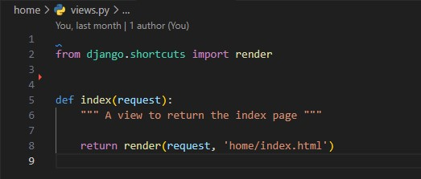

- **home/urls.py:**

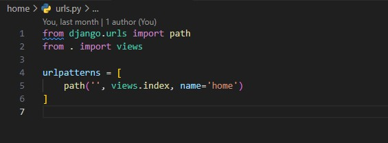

- **iphilosophy_store/urls.py:**

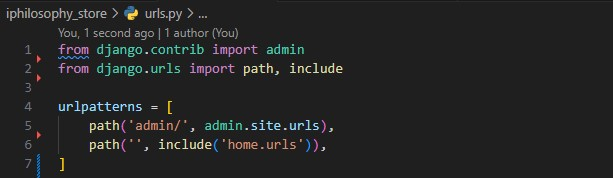

[Back to top](#testing)

### CSS file is conected

Ensure that my own css and js files are linked correctly to base.html via head.html and scripts.html. These component files are inserted to base.html using Django Templates.

- **Created my own file CSS**

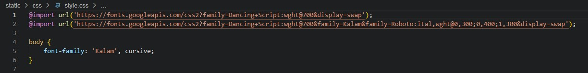

- **Linked on base.html**

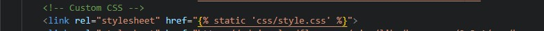

- **Added on the top of base.html**

- **Added script.js on base.html**

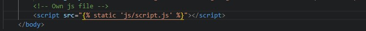

- **Collectstatic**

I included django.contrib.staticfiles in my INSTALLED_APPS in Setting. And Added:

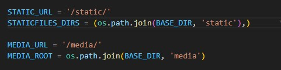

- **Deleted DISABLE_COLLECTSTATIC**

I excluded DISABLE_COLLECTSTATIC on Heroku's Config Vars. I used the command to push to GitHub and everything was working.

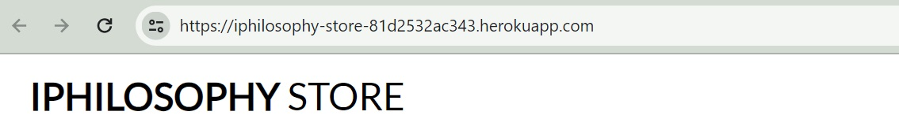

[Back to top](#testing)

### Base Html is linked

The main content is in *home/template/home/index.html*, and to ensure that base.html is included on index.html and in all the others html files, it is added on the top of the html files:

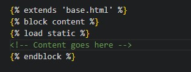

Following the ** in the end of the page content.

### Load Index Html and Base Html

- Expected:
	 - Home page is expected to load all css and bootstrap when the user loads the page for the first time.
- Testing:
	 - Tested the feature by loading the link page.
- Result:
	 - The feature acted as normally and it open with the static files.

[Back to top](#testing)

### Check Allauth

#### Register New User

- Expected:
    - When a new user wants to register, they need to fill out a form with their email address, name, and password. After submitting the form, they will receive a confirmation email. To complete the registration process, they will need to click on the confirmation link in the email and use the provided information to log in.

- Testing:
    - To test this feature, I fill out the form and receved and email to confirm my registration.

- Result:
    - The feature acted as expected and I receaved the confimation email.

- The form to fill out:

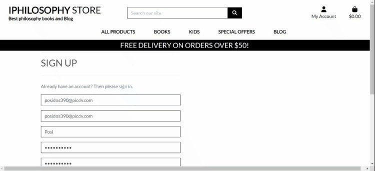

- Confirmation Email:

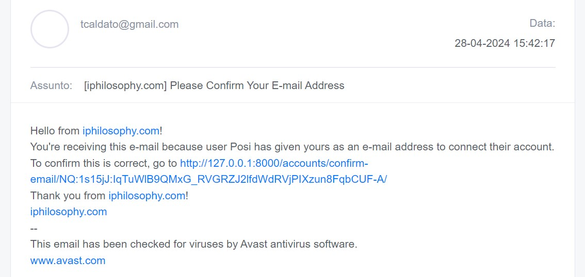

- Login after confirming Email:

#### Home Page

- Expected:
    - It is expected that when the user loads the page for the first time, only the links About Iphilosophy, Register and Login will appear in the menu in the navbar.

- Testing:
    - To test this feature, I loaded the link page without logging in.

- Result:
    - The feature acted as expected and only showed the 3 links mentioned above.

- Expected:
    - It is expected that when the user loads the page already logged in, the links About Iphilosophy, My Profile, Logout, and Wishlist will appear in the menu in the navbar. And if the User is a Super User, it will appear the link to Product Management.

- Testing:
    - To test this feature, I loaded the page as a normal User and as a Super User.

- Result:
    - The feature acted as expected and showed the links according to the type of User.

- Logged as Super User:

Logged as a Normal User:

#### Product Page

- Expected:
     - It is expected that when a regular user loads the product page, they won't have access to the delete and edit buttons on the product page. If a Super User logs in to the page they will have that access.

- Testing:
     - To test this feature, I loaded the page as a normal User and as a Super User.

- Result:
     - The feature acted as expected and showed the buttons according to the type of User.

- Logged as Super User:

Logged as a Normal User:

[Back to top](#testing)

#### Detail Product Page

- Expected:
     - It is expected that when a regular user loads the detail product page, they won't have access to the delete and edit buttons as well like on the product page. If a Super User logs in to the page they will have that access.

- Testing:
     - To test this feature, I loaded the page as a normal User and as a Super User.

- Result:
     - The feature acted as expected and showed the buttons according to the type of User.

- Logged as Super User:

Logged as a Normal User:

[Back to top](#testing)

#### Blog Page

- Expected:
     - It is expected that when User/Super User are not logged in, they won't have access to the Comment form.

- Testing:
     - To test this feature, I loaded the page logged in and not logged in.

- Result:
     - The feature acted as expected and showed the form when logged in.

- Logged in:

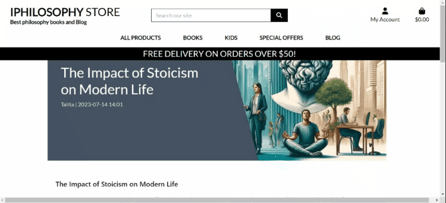

Not logged:

[Back to top](#testing)

#### Wishlist Page

- Expected:
     - When a User or Super User is not logged in, they should not have access to the Wishlist. If they click on the Wishlist button, they should be redirected to the Login page. Once they are logged in, they should be able to add products to their Wishlist by clicking on the button, and they should be able to access the List using the Wishlist link in the Navbar.

- Testing:
     - To test this feature, I clicked the Wishlist button not logged in. And, when logged in I clicked on the link on the Navbar.

- Result:
     - The feature acted as expected and redirected the user to the Login page when not logged in. And, when logged in, the User can have access to the Wishlist link on the Navbar

- Logged in:

Not logged:

[Back to top](#testing)

#### Product Management Page

- Expected:
     - When Super User is logged in, they should not have access to the Product Management page. If they click on the Product Management button, they should be add products to the website.
- Testing:
     - To test this feature, I clicked the Product Management button logged in.

- Result:
     - The feature acted as expected and redirected the user to the Product Management page logged in.

#### Admin page

- It is possible to have access to the Admin Page only with a Super User registered. In this part the Super User has access to all Reviews, Comments, Collaboration text, to add, remove or edit products, have access to the registered emails, Posts, and the Orders done.

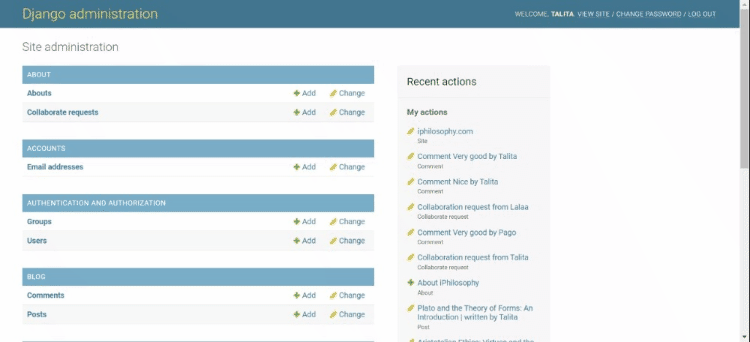

[Back to top](#testing)

### Links and Buttons in the Land Page

- Expected:
     - When a user clicks on the buttons and links, they should open or redirect to the desired page.

- Testing:
     - To verify this feature, I clicked on all buttons and links.

- Result:
     - All buttons and links behaved as expected and redirected to the desired page. No issues were encountered during the test. You can see some of the successful clicks in the GIF below.

[Back to top](#testing)

### Footer

- Expected:
     - It is expected that the footer to have links to the social media pages including Facebook and Instagram, a link to the About Iphilosophy page, and a MailChimp subscription form. The user should be able to click on the links or fill out their email in the MailChimp form.

- Testing:
     - To verify this feature, I clicked on all links. And subscribed to the MailChimp.

- Result:
     - All links redirected to the desired page and the email subscription is functioning properly.

- MailChimp and About Iphilosophy link:

- Social Media link:

[Back to top](#testing)

### Blog

- Expected:
     - When the user clicks on the "Blog" link on the landing page, they should be redirected to the blog page. On the blog page, the posts should be displayed, and clicking on each post should take the user to the post description. If the user is logged in, they should be able to leave a comment.

- Testing:
     - To test this feature, I clicked on the Blog link, scrolled down, clicked on a post, and left a comment.

- Result:
     - The link redirected to the desired page and the comment form is functioning properly.

[Back to top](#testing)

#### Blog Delete and Edit Comment

- Expected:
     - When the user is logged in and Comment a post, they will be able to Edit and Delete their own Comment.

- Testing:
     - To test this feature, I left a comment, edit and delete that comment.

- Result:
     - The Comment first was edited and after was deleted, feature is functioning properly.

[Back to top](#testing)

### About Iphilosophy

- Expected:
     - Users can access information about the website by clicking on the "About iPhilosophy" link located in the Navbar or the footer. In this section, users can share their opinions about the site, or express their thoughts on Philosophy in general.

- Testing:
     - To test this feature, I left a comment and clicked on the Submit button.

- Result:
     - The page loads and update the comment in the Admin app.

- About Page and the Submit form:

- Submited Form in the admin page:

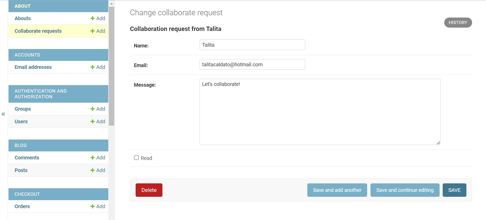

[Back to top](#testing)

### Profile

- Expected:
     - After logging in, users can save their information on the Profile page accessed via the Navbar link. When they log out, their information is saved and can be accessed the next time they log in or visit the page.

- Testing:
     - To test this feature, I filled out the form, left the page, and returned to see that the information was saved on the profile page.

- Result:
     - The page loads and submit the information to admin page.

[Back to top](#testing)

### Search our site

- Expected:
     - Users can search for products on the website writing the work in the search box.

- Testing:
     - To test this feature, I wrote some words to be search on the website.

- Result:
     - The site showed up all the products that I looked for.

[Back to top](#testing)

### Product Page Review

- Expected:
     - After logging in, users can rate products with a text review and a 1-5 star rating. Users have the ability to edit or delete their own reviews.

- Testing:
     - To test this feature, I left a review text and chose a star rating. Then, I edited and deleted the review and rating.

- Result:
     - The form is working correctly, and both the edit and delete buttons are functioning as intended.

- Product Review Text:

- Product Edit and Delete Review:

[Back to top](#testing)

### Wishlist

- Expected:
     - Once users have logged in, they can add products to their wishlist by clicking on the "Wishlist" button below each product. To access the wishlist, users can click on the "Wishlist" option in the Navbar. From there, they can choose to add the products to their bag, remove products from the wishlist, or view product details by clicking on the appropriate buttons on the wishlist page.

- Testing:
     - To test this feature, I added products to my Wishlist, added some to my Bag, deleted some from my Wishlist, and clicked the button to see the product details.

- Result:
     - All the features acted as normally and all the Bag, Delete and Details buttons are functioning as intended.

- Wishlist Adding Products:

- Wishlist Delete, Add to Bag and Detail button:

[Back to top](#testing)

### Shooping Bag Page

#### Bag Button and Link

- Expected:
     - Users can add products to their shopping bag by clicking on the 'Add to Bag' button on the product detail page or on the wishlist page. When the user clicks on the 'Add to Bag' button, a Django message will be displayed, confirming that the product has been added to the bag. To access the bag page, the user can either click on the message pop-up or click on the 'Bag' link located at the top right of the page.

- Testing:
     - To test this feature, I added some products to the Bag and clicked on the Django pop-up message thet has the 'Go to Secure Checkout' Button.

- Result:
     - All the features acted as normally and the 'Go to Secure Checkout' Button redirects User to the Bag Page.

- Add to the Bag and Go to Secure Checkout Button:

- Access to the Bag Link:

[Back to top](#testing)

#### Bag Update/Remove Product and Secure Checkout button

- Expected:
     - Users have the option to update or remove products from their Bag Page by clicking on the respective buttons. Additionally, users can select the desired quantity and product they wish to purchase, and then proceed to the Secure Checkout Button to complete the purchase.

- Testing:
     - To test this feature, I updated and remove the amount of products using the buttons for each products and clicked on the Secure Checkout button.

- Result:
     - All the features acted as normally and the 'Secure Checkout' Button redirects User to the Checkout Page.

- Add to the Bag and click on Secure Checkout Button:

### Checkout

- Expected:
     - Users have the option to fill out the necessary information in case they are not logged in and want to purchase the products. For users who are logged in and have already made a purchase before, they can use the same information as before to complete the purchase. Stripe is used as a payment gateway to complete the purchase. Once the product is paid for, the user will receive an email with the order confirmation and the details of the products bought.

- Testing:
     - To test this feature, I fill out my informations and the informations of the payment card, and click on the button 'Complete Order'.

- Result:
     - All the features acted as normally and the 'Complete Order' Button redirects User to the Sumary of the purchease and Email is delivered to the User.

- The Payment Checkout:

- The Email Confirmation:

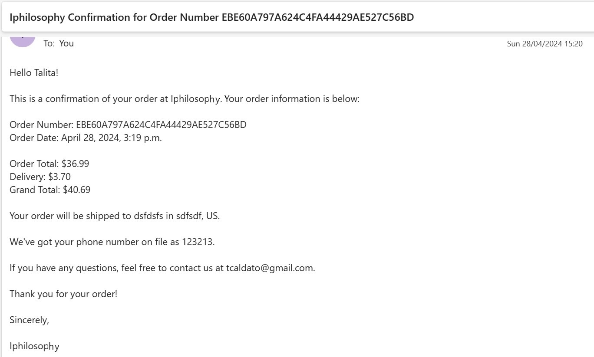

[Back to top](#testing)

### 404 Error Page

- Expected:
     - When Users type a page that does not exist a page 404 with the message 'THE PAGE YOU ARE LOOKING FOR ISN'T AVAILABLE' will be displayed.

- Testing:
     - To test this feature, I typed */class* in the end of the link page.

- Result:
     - After typing */class* the page was displayed.

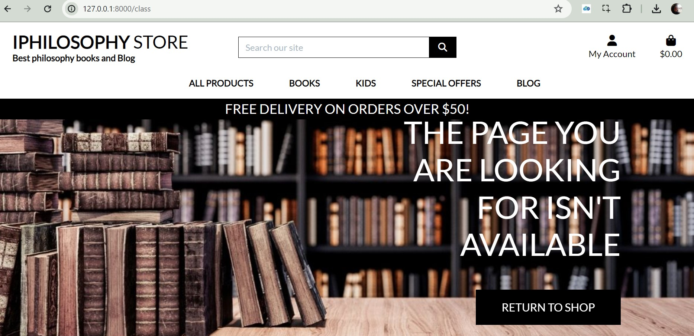

## Validation

Passed in all validators below:

### HTML Validation

[W3C Markup Validator](https://validator.w3.org/)

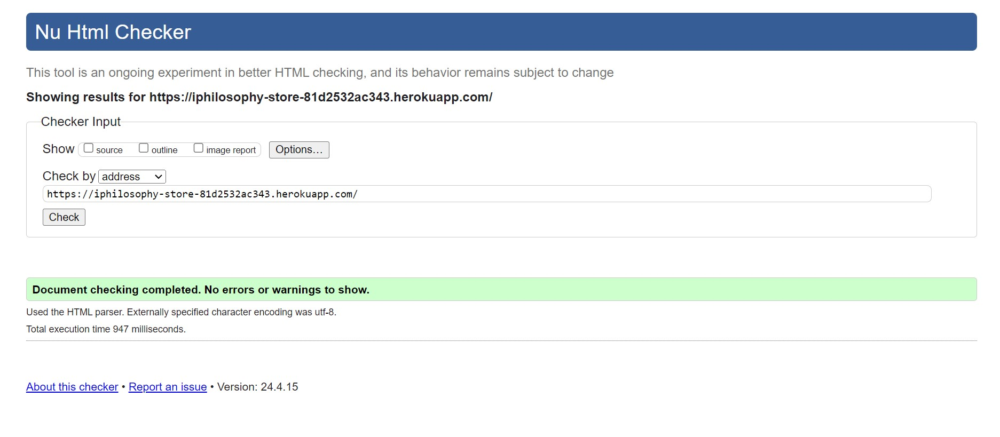

### CSS Validation

[Jigsaw](https://jigsaw.w3.org/css-validator/)  

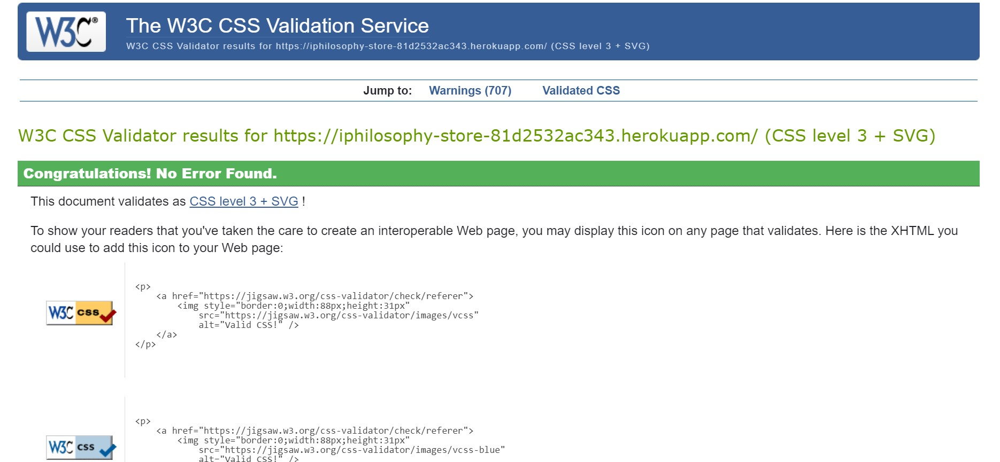

### JS Validation

[JSHint](https://jshint.com/)

Tested all JS codes and all of them passed:

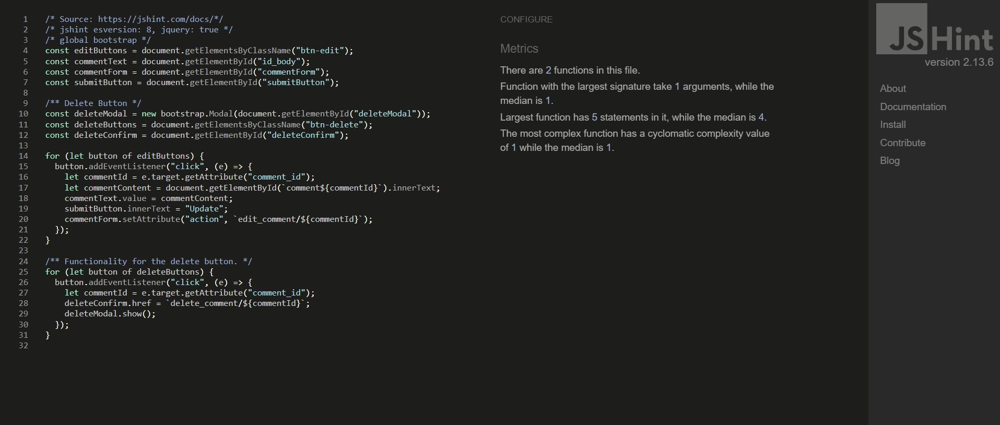

### Python Validation

[PEP8](https://extendsclass.com/python-tester.html/ "Python Validator")

Tested all Python codes and all of them passed:

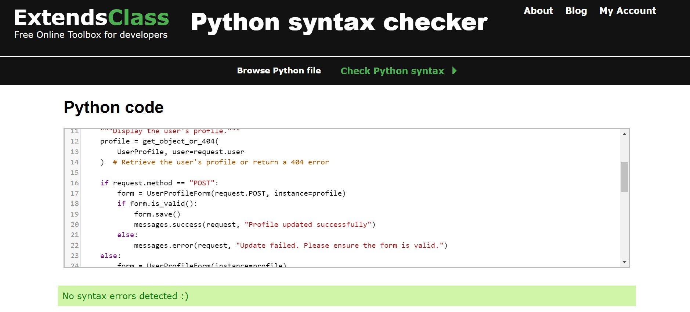

[Back to top](#testing)

## Browsers

- Chrome:

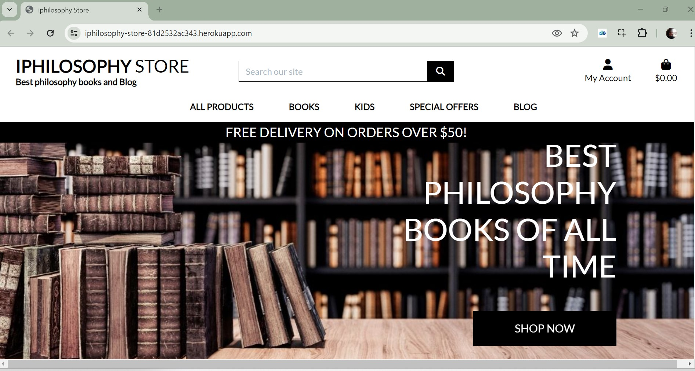

- Edge:

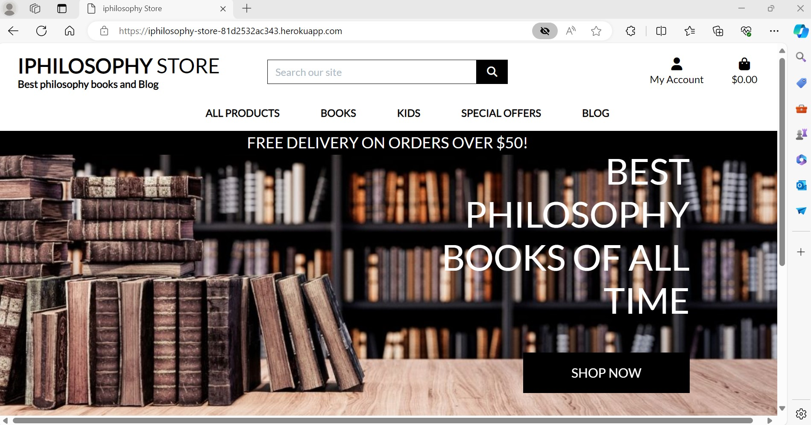

- Firefox:

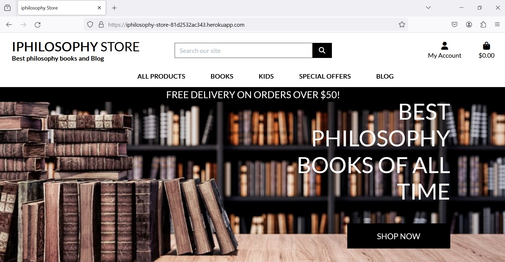

- Opera:

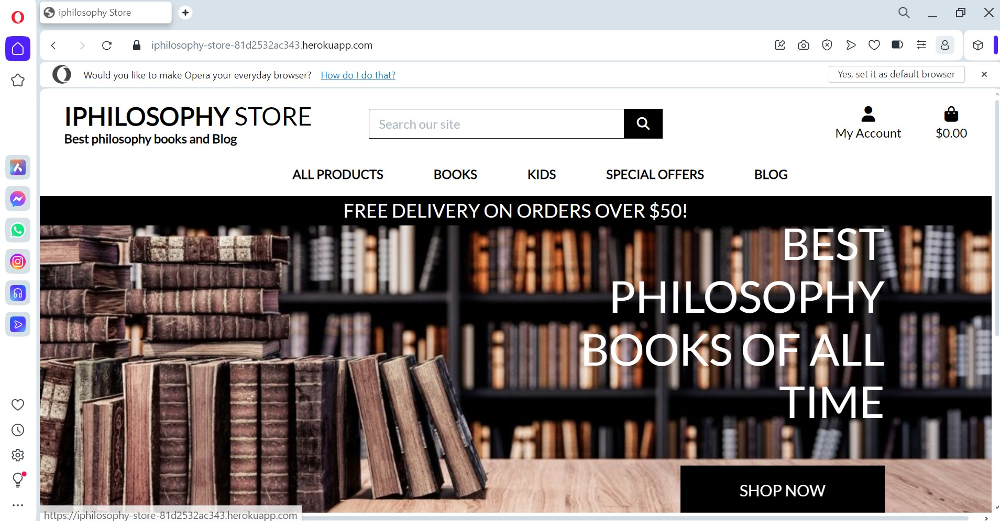

[Back to top](#testing)

Back to Readme file [ReadMe](README.md)