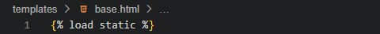

# Testing

## Table of contents

1. [Introduction](#introduction)
2. [Manual Testing](#manual-testing)
    1. [Deployed website is working](#deployed-website-is-working)
    2. [Site opens on the homepage](#site-opens-on-the-homepage)
    3. [CSS file is conected](#css-file-is-conected)
    4. [base.html is linked](#base.html-is-linked)
    5. [Load index.html and base.html](#load-index.html-and-base.html)
    6. [Check allauth working](#check-allauth-working)
    7. [Create and Migrate a Module](#create-and-migrate-a-module)
    8. [Buttons and Links](#buttons-and-links)
    9. [Sign In, Edit, Cancel and Sign Out](#sign-In,-edit,-cancel-and-sign-out)
3. [Validation](#validation)
4. [Lighthouse](#lighthouse)
5. [Browsers](#browsers)

## Introduction

In order to ensure that the project is executed according to the plan, a comprehensive set of tests were conducted to achieve the desired objectives. The tests were aimed at assessing the functionality, performance and reliability of the project, and to identify any issues that could potentially impact its success. The results of the tests were carefully analyzed and used to refine the project plan.

## Manual Testing

### 1. Deployed website is working

To ensure the live project works properly, I followed all the steps that were provided by the Code Institute course. These steps are well documented in the latter sections of the [Deployment](DEPLOY.md).

[Back to top](#testing)

### 2. Site opens on the homepage

To ensure that the deployed site opens on the homepage, it was created a function-based view in the home app and added a path in the URL file of the home app. Then, referenced the home app URL in the iphilosophy_store URL file.

- **home/views.py:**

- **home/urls.py:**

- **iphilosophy_store/urls.py:**

[Back to top](#testing)

### 3. CSS file is conected

Ensure that my own css and js files are linked correctly to base.html via head.html and scripts.html. These component files are inserted to base.html using Django Templates.

- **Created my own file CSS**

- **Linked on base.html**

- **Added on the top of base.html**

- **Added script.js on base.html**

- **Collectstatic**

I included django.contrib.staticfiles in my INSTALLED_APPS in Setting. And Added:

- **Deleted DISABLE_COLLECTSTATIC**

I excluded DISABLE_COLLECTSTATIC on Heroku's Config Vars. I used the command to push to GitHub and everything was working.

[Back to top](#testing)

### 4. base.html is linked

The main content is in *home/template/home/index.html*, and to ensure that base.html is included on index.html and in all the others html files, it is added on the top of the html files:

Following the ** in the end of the page content.

### 5. Load index.html and base.html

After everything is connected the page loads normally:

